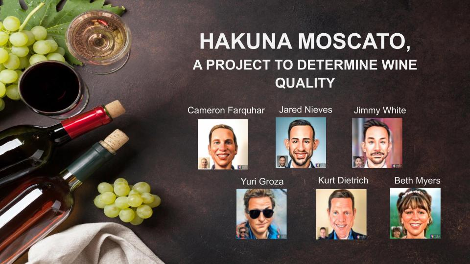

# HAKUNA MOSCATO,
A PROJECT TO DETERMINE WINE QUALITY

Final result: https://hakuna-moscato.herokuapp.com

## Team Members:

* Cameron Farquhar
* Jared Nieves
* Jimmy White
* Kurt Dietrich
* Beth Myers
* Yuri Groza

## Project Description/Outline:

* Visualization includes a Python Flask-powered API, HTML/CSS, JavaScript, and an SQL database. 
* In addition to the above, we utilized: Heroku, Bootstrap, Plotly, Leaflet and D3
* Powered by a dataset with over 200000 records
* Includes user-driven interaction 
 

## Datasets:

## Preliminary research
 
 
 
 
 
## Machine learning and deployment
 
 
 
 
 
## Special thanks

